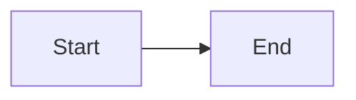

# How to Visualize Mermaid Diagrams

This guide explains various ways to view and render the Mermaid diagrams in this documentation.

## Quick Options (Recommended)

### 1. **VS Code Extension** (Best for Development)
If you're using VS Code:

1. Install the **Markdown Preview Mermaid Support** extension:
   - Extension ID: `bierner.markdown-mermaid`
   - Or search for "Markdown Preview Mermaid Support" in VS Code Extensions

2. Open the markdown file (`product-flow.md`)
3. Press `Ctrl+Shift+V` (Windows/Linux) or `Cmd+Shift+V` (Mac) to open preview
4. Diagrams will render automatically!

**Alternative VS Code Extension:**
- **Mermaid Preview** by `vstirbu.vscode-mermaid-preview`
- Right-click on the file → "Open Preview" or use Command Palette

### 2. **Online Mermaid Editor** (Easiest)
1. Go to: https://mermaid.live/
2. Copy the mermaid code block (the content between ` ```mermaid ` and ` ``` `)
3. Paste into the editor
4. View the rendered diagram instantly
5. You can export as PNG, SVG, or PDF

### 3. **GitHub/GitLab** (If Pushed to Repository)
- Push the markdown file to GitHub or GitLab
- View the file in the repository
- Mermaid diagrams render automatically in GitHub/GitLab markdown viewers

## Advanced Options

### 4. **Command Line Tools**

#### Using Mermaid CLI (Node.js)
```bash
# Install globally
npm install -g @mermaid-js/mermaid-cli

# Convert to PNG
mmdc -i docs/architecture/product-flow.md -o output.png

# Convert to SVG
mmdc -i docs/architecture/product-flow.md -o output.svg
```

#### Using Pandoc (with mermaid filter)
```bash
# Install pandoc and mermaid-filter
npm install -g @mermaid-js/mermaid-cli
pip install pandoc-mermaid-filter

# Convert to HTML
pandoc docs/architecture/product-flow.md -o output.html --filter pandoc-mermaid
```

### 5. **Browser Extensions**

#### Chrome/Edge:
- **Markdown Viewer** extension
- **Mermaid Diagrams** extension

#### Firefox:
- **Markdown Viewer** add-on

### 6. **Standalone Applications**

#### Obsidian
- Obsidian natively supports Mermaid diagrams
- Open the markdown file in Obsidian

#### Typora
- Paid markdown editor with built-in Mermaid support
- Open the file and diagrams render automatically

### 7. **Python Script** (For Automation)

Create a simple script to convert all diagrams:

```python
# convert_mermaid.py
import subprocess
import re
from pathlib import Path

def extract_mermaid_blocks(file_path):
    """Extract all mermaid code blocks from markdown."""
    content = Path(file_path).read_text()
    pattern = r'```mermaid\n(.*?)\n```'
    matches = re.findall(pattern, content, re.DOTALL)
    return matches

def convert_to_svg(mermaid_code, output_path):
    """Convert mermaid code to SVG using mermaid-cli."""
    # Requires: npm install -g @mermaid-js/mermaid-cli
    subprocess.run([
        'mmdc', '-i', '-', '-o', output_path
    ], input=mermaid_code.encode(), check=True)

# Usage
if __name__ == '__main__':
    file_path = 'docs/architecture/product-flow.md'
    blocks = extract_mermaid_blocks(file_path)
    for i, block in enumerate(blocks):
        convert_to_svg(block, f'diagram_{i}.svg')
```

## Recommended Workflow

**For Quick Viewing:**
1. Use VS Code with Mermaid extension (if you're already in VS Code)
2. Or use https://mermaid.live/ for instant viewing

**For Documentation:**
1. Push to GitHub/GitLab for automatic rendering
2. Or use mermaid-cli to generate static images

**For Presentations:**
1. Use mermaid.live to export as PNG/SVG
2. Or use Obsidian/Typora for live editing

## Troubleshooting

**Diagrams not rendering in VS Code?**
- Make sure you have a Mermaid extension installed
- Try the "Markdown Preview Mermaid Support" extension
- Check that the code block uses ` ```mermaid ` (not ` ```mermaid` or ` ``` mermaid`)

**Diagrams too large?**
- Use mermaid.live to adjust the zoom
- Export as SVG and scale in an image editor
- Break large diagrams into smaller sub-diagrams

**Need to edit diagrams?**
- Use mermaid.live for interactive editing
- Or edit the markdown directly and preview in VS Code

## Quick Test

To verify your setup works, try this simple diagram:



If you can see a simple flowchart with "Start" → "End", your setup is working!


