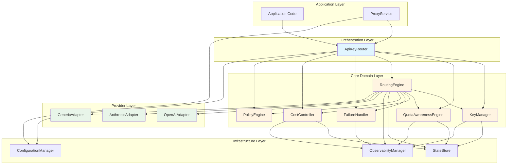
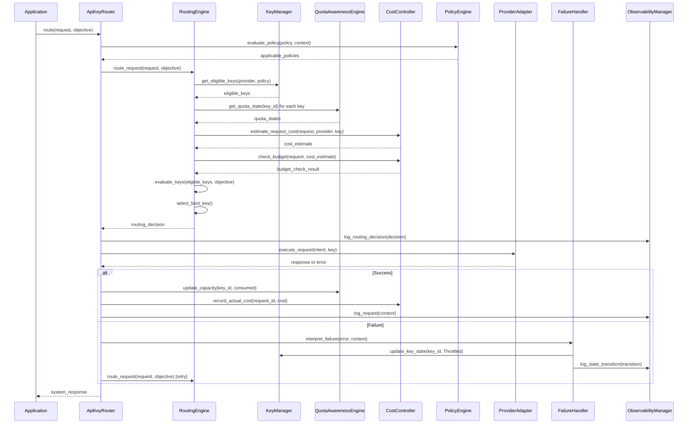

# Components

Based on the architectural patterns, tech stack, and data models, the following major logical components are identified. Each component has clear responsibilities, interfaces, and dependencies.

## KeyManager

**Responsibility:** Manages API key lifecycle, state transitions, and key selection eligibility. Ensures keys are individually addressable with stable identity, and that key state is explicit and observable.

**Key Interfaces:**
- `register_key(key_material: str, provider_id: str, metadata: dict) -> APIKey` - Register a new API key
- `get_key(key_id: str) -> APIKey | None` - Retrieve key by ID
- `update_key_state(key_id: str, new_state: KeyState, reason: str) -> StateTransition` - Update key state with audit trail
- `get_eligible_keys(provider_id: str, policy: Policy) -> list[APIKey]` - Get keys eligible for routing based on state and policy
- `revoke_key(key_id: str) -> None` - Revoke key (graceful degradation)
- `rotate_key(old_key_id: str, new_key_material: str) -> APIKey` - Rotate key without breaking system identity

**Dependencies:**
- StateStore (for persistence)
- PolicyEngine (for policy evaluation)
- ObservabilityManager (for state transition events)

**Technology Stack:** Python 3.11, asyncio, pydantic models

**Key Features:**
- State machine enforcement (valid transitions only)
- Audit trail for all state changes
- Policy-gated key eligibility
- Graceful degradation when keys revoked

## QuotaAwarenessEngine

**Responsibility:** Implements forward-looking quota awareness with predictive exhaustion. Tracks remaining capacity over time with multi-state model (Abundant → Constrained → Critical → Exhausted). Calculates exhaustion predictions and updates quota state based on usage.

**Key Interfaces:**
- `update_capacity(key_id: str, consumed: int, cost_estimate: CostEstimate) -> QuotaState` - Update capacity after request
- `get_quota_state(key_id: str) -> QuotaState` - Get current quota state
- `predict_exhaustion(key_id: str) -> ExhaustionPrediction | None` - Predict when key will exhaust
- `calculate_capacity_estimate(key_id: str) -> CapacityEstimate` - Calculate remaining capacity with uncertainty
- `handle_quota_response(key_id: str, response: HTTPResponse) -> QuotaState` - Interpret 429/rate limit responses
- `reset_quota(key_id: str, time_window: TimeWindow) -> QuotaState` - Reset quota for time window

**Dependencies:**
- StateStore (for quota state persistence)
- KeyManager (for key information)
- CostController (for cost estimates)
- ObservabilityManager (for quota state events)

**Technology Stack:** Python 3.11, asyncio, datetime for time windows, statistical models for prediction

**Key Features:**
- Multi-state capacity model (not binary)
- Time-window awareness (daily, hourly, monthly resets)
- Predictive exhaustion calculation
- Uncertainty modeling (explicit confidence levels)
- Variable cost per request support

## RoutingEngine

**Responsibility:** Makes intelligent routing decisions based on explicit objectives, current state, and policies. Routes are chosen intentionally with explainable reasoning, not automatically. Supports multiple routing strategies (cost-optimized, reliability-optimized, fairness-based).

**Key Interfaces:**
- `route_request(request: RequestContext, objective: RoutingObjective) -> RoutingDecision` - Make routing decision
- `evaluate_keys(eligible_keys: list[APIKey], objective: RoutingObjective) -> dict[str, float]` - Score keys against objective
- `explain_decision(decision: RoutingDecision) -> str` - Generate human-readable explanation
- `update_routing_feedback(decision_id: str, success: bool, metrics: dict) -> None` - Learn from outcomes
- `get_routing_strategies() -> list[RoutingStrategy]` - List available routing strategies

**Dependencies:**
- KeyManager (for eligible keys)
- QuotaAwarenessEngine (for quota state)
- CostController (for cost information)
- PolicyEngine (for policy evaluation)
- FailureHandler (for health information)
- StateStore (for routing history)

**Technology Stack:** Python 3.11, asyncio, policy evaluation algorithms

**Key Features:**
- Explicit objective optimization (cost, reliability, fairness, quality)
- State-dependent decisions (considers quota, cost, health)
- Explainable choices (human-readable explanations)
- Signal-driven adaptation (reacts to degradation, not just failure)
- Uncertainty representation (confidence in decisions)

## ProviderAdapter (Abstract Interface)

**Responsibility:** Abstract interface for provider-specific implementations. Translates system intent to provider execution, normalizes responses, and declares capabilities. All provider-specific logic contained in adapters.

**Key Interfaces:**
- `execute_request(intent: RequestIntent, key: APIKey) -> ProviderResponse` - Execute request with provider
- `normalize_response(provider_response: Any) -> SystemResponse` - Normalize to system format
- `map_error(provider_error: Exception) -> SystemError` - Map provider errors to system categories
- `get_capabilities() -> ProviderCapabilities` - Declare what provider supports
- `estimate_cost(request_intent: RequestIntent) -> CostEstimate` - Estimate request cost
- `get_health() -> HealthState` - Get provider health status

**Dependencies:**
- httpx (for HTTP client)
- System models (RequestIntent, SystemResponse, etc.)

**Technology Stack:** Python 3.11, asyncio, httpx, provider-specific SDKs

**Key Features:**
- System-defined model (providers adapt to you)
- Contained special cases (no provider logic in core)
- Mechanical extensibility (fixed interface questions)
- Intent vs. execution separation

**Concrete Implementations:**
- `OpenAIAdapter` - OpenAI provider implementation
- `AnthropicAdapter` - Anthropic provider implementation
- `GenericHTTPAdapter` - Generic HTTP API adapter (for non-LLM providers)

## FailureHandler

**Responsibility:** Handles failures gracefully by interpreting errors semantically, reducing load under failure, containing failures, and enabling automatic recovery. Implements circuit breaker pattern and backpressure.

**Key Interfaces:**
- `interpret_failure(error: Exception, context: RequestContext) -> FailureInterpretation` - Interpret error semantically
- `update_key_health(key_id: str, failure: FailureInterpretation) -> None` - Update key health based on failure
- `should_retry(failure: FailureInterpretation, attempt: int) -> bool` - Determine if retry is safe
- `get_circuit_state(key_id: str) -> CircuitState` - Get circuit breaker state
- `reduce_load_on_failure(key_id: str, provider_id: str) -> None` - Apply backpressure
- `monitor_recovery(key_id: str) -> None` - Monitor failed components for recovery

**Dependencies:**
- KeyManager (for key state updates)
- QuotaAwarenessEngine (for quota interpretation)
- ObservabilityManager (for failure events)
- StateStore (for circuit breaker state)

**Technology Stack:** Python 3.11, asyncio, circuit breaker implementation

**Key Features:**
- Semantic failure interpretation (rate limit vs. provider down vs. network)
- Load reduction under failure (not amplification)
- Failure containment (circuit breakers)
- Automatic recovery monitoring
- Partial progress support (degraded output OK)

## CostController

**Responsibility:** Proactive cost control with budget enforcement before execution. Estimates costs, tracks spending, enforces budgets, and reconciles estimates with actuals.

**Key Interfaces:**
- `estimate_request_cost(request: RequestContext, provider_id: str, key_id: str) -> CostEstimate` - Estimate cost before execution
- `check_budget(request: RequestContext, estimated_cost: CostEstimate) -> BudgetCheckResult` - Check if request would exceed budget
- `record_actual_cost(request_id: str, actual_cost: Decimal) -> None` - Record actual cost after execution
- `reconcile_estimate(request_id: str, estimated: CostEstimate, actual: Decimal) -> None` - Learn from deviations
- `get_budget_status(scope: BudgetScope) -> BudgetStatus` - Get current budget status
- `enforce_budget(scope: BudgetScope, mode: EnforcementMode) -> None` - Enforce budget limits

**Dependencies:**
- ProviderAdapter (for cost models)
- StateStore (for budget tracking)
- ObservabilityManager (for cost events)
- RoutingEngine (for cost-aware routing)

**Technology Stack:** Python 3.11, asyncio, Decimal for precise currency calculations

**Key Features:**
- Pre-execution cost estimation
- Proactive budget enforcement (prevent, not react)
- Cost-aware routing decisions
- Trade-off awareness (cost vs. quality/reliability)
- Uncertainty modeling (variable pricing, unknown factors)
- Reconciliation loop (learns from actuals)

## PolicyEngine

**Responsibility:** Evaluates declarative policies that drive routing, cost control, and key selection. Policies express intent, not procedure. Supports policy hierarchy and precedence.

**Key Interfaces:**
- `evaluate_policy(policy: Policy, context: dict) -> PolicyResult` - Evaluate policy against context
- `get_applicable_policies(scope: PolicyScope, type: PolicyType) -> list[Policy]` - Get policies that apply
- `resolve_policy_conflicts(policies: list[Policy]) -> Policy` - Resolve conflicts using precedence
- `validate_policy(policy: Policy) -> ValidationResult` - Validate policy configuration
- `dry_run_policy(policy: Policy, context: dict) -> PolicyImpact` - Predict policy impact

**Dependencies:**
- StateStore (for policy storage)
- ConfigurationManager (for policy loading)

**Technology Stack:** Python 3.11, policy evaluation DSL or JSON schema

**Key Features:**
- Declarative intent (what, not how)
- Policy hierarchy (default < global < local)
- Safe defaults
- Impact observability (dry-run mode)
- Constraint enforcement

## StateStore

**Responsibility:** Manages state persistence and retrieval. Supports in-memory (default) and optional persistent backends (Redis, database). Provides abstraction over state storage.

**Key Interfaces:**
- `save_key(key: APIKey) -> None` - Save/update key
- `get_key(key_id: str) -> APIKey | None` - Retrieve key
- `save_quota_state(state: QuotaState) -> None` - Save quota state
- `get_quota_state(key_id: str) -> QuotaState | None` - Retrieve quota state
- `save_routing_decision(decision: RoutingDecision) -> None` - Save routing decision
- `save_state_transition(transition: StateTransition) -> None` - Save state transition
- `query_state(query: StateQuery) -> list[Any]` - Query state with filters

**Dependencies:**
- Optional: redis (for distributed state)
- Optional: database adapter (for audit logs)

**Technology Stack:** Python 3.11, in-memory dict (default), optional redis, optional SQLAlchemy

**Key Features:**
- In-memory by default (stateless deployment)
- Optional persistence backends
- Transaction support (for consistency)
- Query interface for observability

## ConfigurationManager

**Responsibility:** Manages system configuration from environment variables, files, or programmatic API. Provides type-safe, validated configuration with safe defaults.

**Key Interfaces:**
- `load_configuration() -> Configuration` - Load configuration from sources
- `get_setting(key: str, default: Any = None) -> Any` - Get configuration setting
- `validate_configuration(config: dict) -> ValidationResult` - Validate configuration
- `reload_configuration() -> None` - Hot reload configuration (proxy mode)
- `get_defaults() -> Configuration` - Get safe default configuration

**Dependencies:**
- pydantic-settings (for type-safe settings)

**Technology Stack:** Python 3.11, pydantic-settings, environment variables

**Key Features:**
- Type-safe configuration
- Environment variable support (stateless)
- Safe defaults
- Hot reload (proxy mode)
- Validation and constraint enforcement

## ObservabilityManager

**Responsibility:** Provides observability through structured logging, metrics, and tracing. Emits events for state changes, routing decisions, and failures. Enables full system observability.

**Key Interfaces:**
- `log_request(context: RequestContext) -> None` - Log request with full context
- `log_routing_decision(decision: RoutingDecision) -> None` - Log routing decision
- `log_state_transition(transition: StateTransition) -> None` - Log state change
- `emit_metric(name: str, value: float, tags: dict) -> None` - Emit performance metric
- `get_trace(request_id: str) -> Trace` - Get full trace for request
- `subscribe_to_events(event_type: str, callback: Callable) -> None` - Subscribe to events

**Dependencies:**
- structlog (for structured logging)
- Optional: metrics backend (Prometheus, etc.)

**Technology Stack:** Python 3.11, structlog, asyncio events

**Key Features:**
- Structured logging (JSON output)
- Correlation IDs for tracing
- Event emission for components
- Metrics collection
- Full request traceability

## ApiKeyRouter (Main Orchestrator)

**Responsibility:** Main entry point for library. Orchestrates components to handle API requests. Provides simple API for applications while coordinating complex internal logic.

**Key Interfaces:**
- `route(request: RequestIntent, objective: RoutingObjective | None = None) -> SystemResponse` - Route request intelligently
- `register_provider(provider: Provider, adapter: ProviderAdapter) -> None` - Register provider
- `register_key(key_material: str, provider_id: str, metadata: dict) -> APIKey` - Register API key
- `get_state_summary() -> StateSummary` - Get system state summary
- `configure_policy(policy: Policy) -> None` - Configure routing/cost policy

**Dependencies:**
- All core components (KeyManager, RoutingEngine, QuotaAwarenessEngine, etc.)

**Technology Stack:** Python 3.11, asyncio

**Key Features:**
- Simple API for applications
- Coordinates all components
- Handles errors gracefully
- Provides observability hooks

**Usage Example - Simple LLM API with Automatic Key Switching:**

```python
from apikeyrouter import ApiKeyRouter

# Initialize router
router = ApiKeyRouter()

# Register provider (one-time setup)
router.register_provider("openai", OpenAIAdapter())

# Register multiple API keys (key management handled by library)
router.register_key("sk-openai-key1", "openai", {"tier": "pay-as-you-go"})
router.register_key("sk-openai-key2", "openai", {"tier": "pay-as-you-go"})
router.register_key("sk-openai-key3", "openai", {"tier": "team"})

# Call LLM - library handles key switching internally
response = await router.route(
    request_intent={
        "model": "gpt-4",
        "messages": [{"role": "user", "content": "Hello!"}]
    },
    objective="reliability"  # Optional: optimize for reliability, cost, etc.
)

# Response includes completion + metadata about which key was used
print(response.content)  # LLM response
print(response.metadata.key_used)  # Which key handled this request
print(response.metadata.cost)  # Cost of this request
```

**Key Switching is Completely Automatic:**
- Library automatically selects best key based on:
  - Quota state (avoids exhausted keys)
  - Cost (if cost-optimization objective)
  - Reliability (success rate, health)
  - Policies (budget limits, constraints)
- If a key fails (rate limit, error), library automatically retries with different key
- If a key is exhausted, library automatically switches to available key
- All key management (state tracking, rotation, health monitoring) is internal

## ProxyService (FastAPI Application)

**Responsibility:** HTTP proxy service that wraps library. Provides OpenAI-compatible endpoints and other API interfaces. Handles HTTP concerns (request/response, authentication, rate limiting).

**Key Interfaces:**
- `POST /v1/chat/completions` - OpenAI-compatible chat completions endpoint
- `GET /health` - Health check endpoint
- `GET /metrics` - Prometheus metrics endpoint
- `GET /state` - System state endpoint (observability)
- `POST /keys` - Key management endpoint
- `POST /policies` - Policy management endpoint

**Dependencies:**
- ApiKeyRouter (library core)
- FastAPI (HTTP framework)
- uvicorn (ASGI server)

**Technology Stack:** Python 3.11, FastAPI, uvicorn, httpx

**Key Features:**
- OpenAI-compatible API
- Stateless deployment
- Environment-based configuration
- Automatic OpenAPI documentation
- Health checks and metrics

---

## Component Diagrams



## Component Interaction Sequence



---

## Design Decisions

1. **Component Separation:** Clear boundaries between domain logic (KeyManager, QuotaAwarenessEngine) and infrastructure (StateStore, ObservabilityManager)
2. **Dependency Direction:** Core components depend on abstractions; infrastructure implements those abstractions
3. **Event-Driven Communication:** Components emit events through ObservabilityManager for loose coupling
4. **Orchestration Layer:** ApiKeyRouter coordinates components but doesn't contain business logic
5. **Provider Abstraction:** Adapters are pluggable; core never depends on specific providers

---

**Select 1-9 or just type your question/feedback:**

1. Proceed to next section (External APIs)
2. Challenge assumptions
3. Explore alternatives
4. Deep dive analysis
5. Risk assessment
6. Stakeholder perspective
7. Scenario planning
8. Constraint analysis
9. Expert consultation

Or type your feedback/questions about the Components section.
