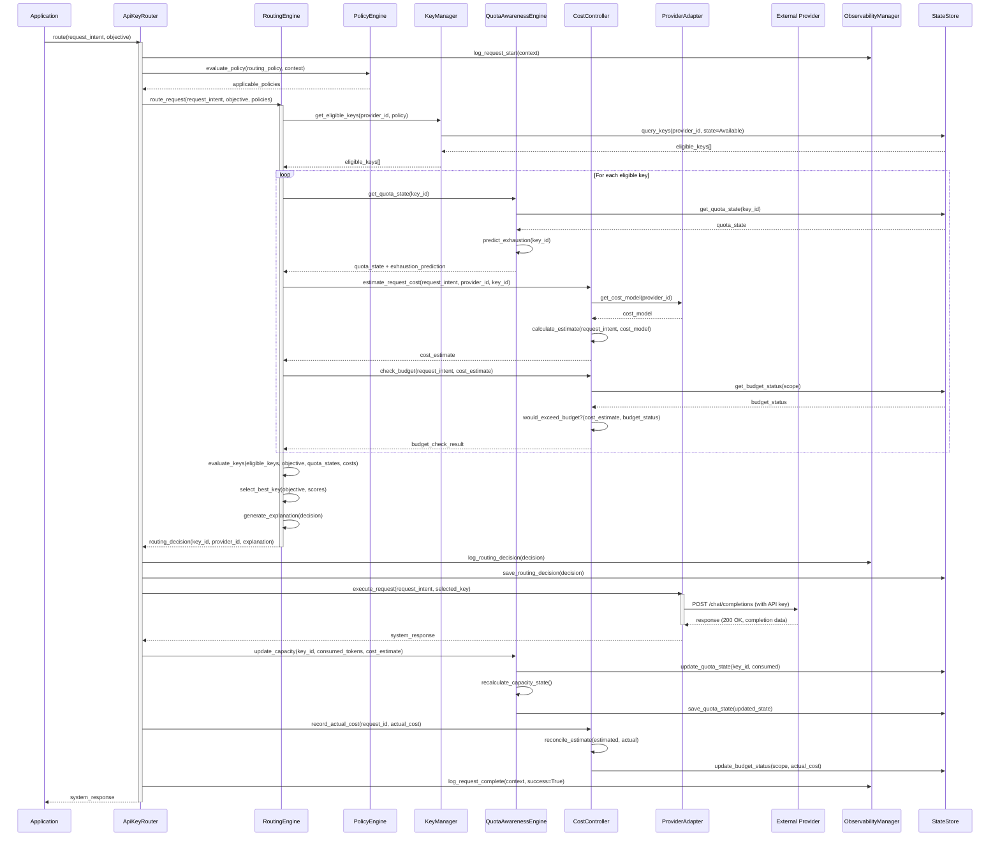
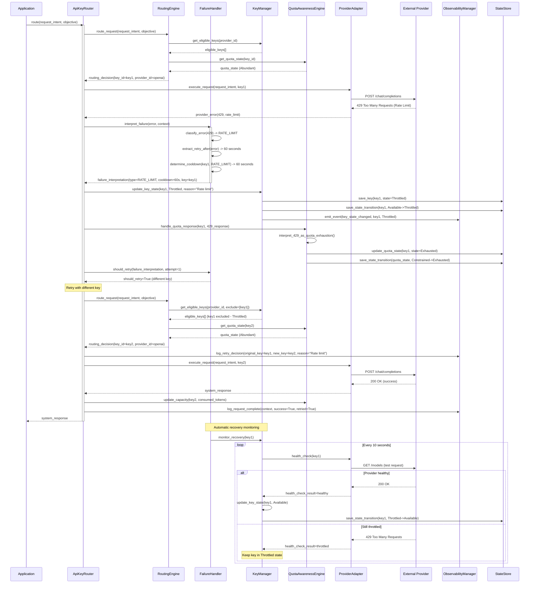
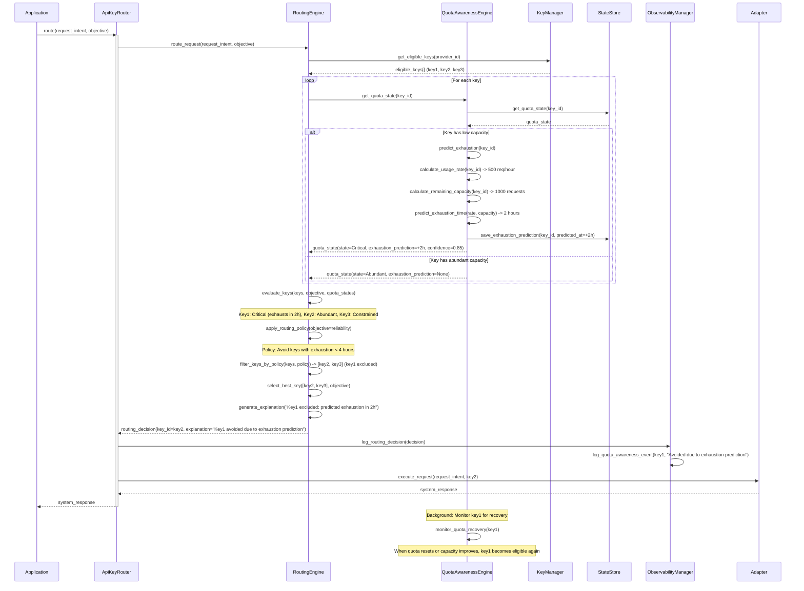
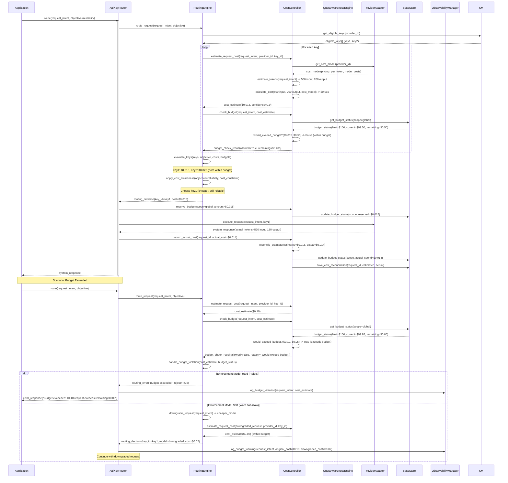
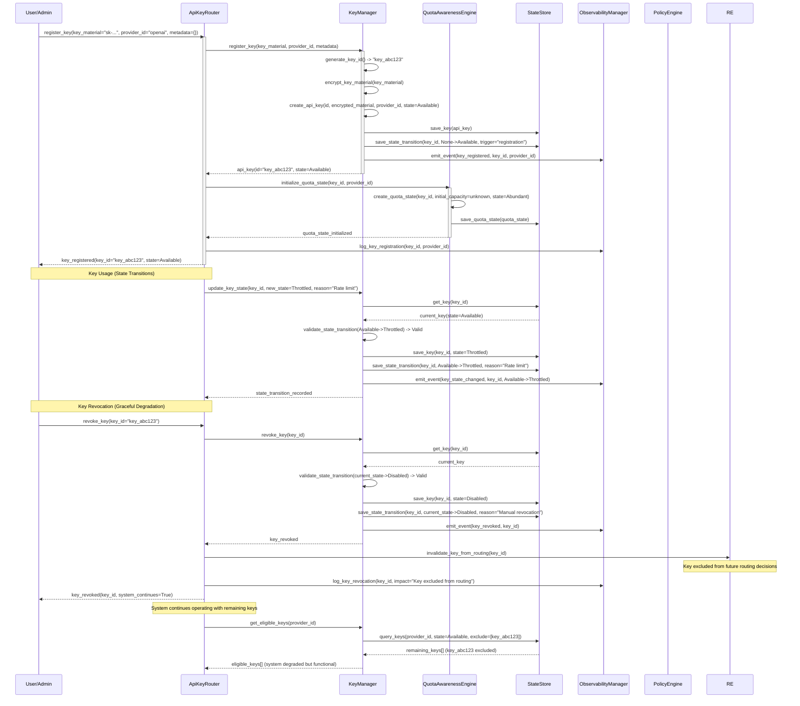
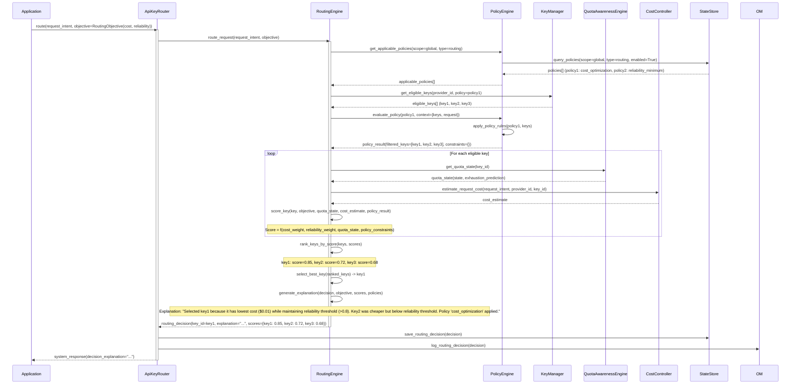

# Core Workflows

This section illustrates key system workflows using sequence diagrams. These workflows demonstrate how components interact to achieve intelligent routing, quota awareness, cost control, and graceful failure handling.

## Workflow 1: Successful Request Routing (Happy Path)

This workflow shows the complete flow of an API request through the system, including quota awareness, cost estimation, intelligent routing, and execution.

## Workflow 2: Request Routing with Failure and Intelligent Retry

This workflow demonstrates graceful failure handling, semantic error interpretation, and intelligent retry with different key/provider.

## Workflow 3: Predictive Quota Exhaustion and Proactive Routing

This workflow demonstrates forward-looking quota awareness - the system predicts exhaustion and routes away from risky keys before they fail.

## Workflow 4: Cost-Aware Routing with Budget Enforcement

This workflow demonstrates proactive cost control - the system estimates costs, checks budgets, and may reject or downgrade requests to stay within budget.

## Workflow 5: Key Registration and State Management

This workflow shows how keys are registered, how state transitions are tracked, and how the system handles key revocation gracefully.

## Workflow 6: Policy Evaluation and Routing Decision Explanation

This workflow demonstrates how policies are evaluated, how routing decisions are made with explicit objectives, and how explanations are generated.

---

## Workflow Design Decisions

1. **Error Handling:** Failures are interpreted semantically and trigger appropriate state transitions
2. **Retry Logic:** Intelligent retries use different keys/providers, not blind retries
3. **Quota Awareness:** System predicts exhaustion and routes proactively, not reactively
4. **Cost Control:** Budgets checked before execution, requests rejected or downgraded if needed
5. **State Transitions:** All state changes are tracked with audit trails
6. **Policy Evaluation:** Policies are evaluated before routing, influencing key selection
7. **Observability:** All decisions and state changes are logged for full traceability

---

**Select 1-9 or just type your question/feedback:**

1. Proceed to next section (REST API Spec - if applicable, or Database Schema)
2. Challenge assumptions
3. Explore alternatives
4. Deep dive analysis
5. Risk assessment
6. Stakeholder perspective
7. Scenario planning
8. Constraint analysis
9. Expert consultation

Or type your feedback/questions about the Core Workflows section.
