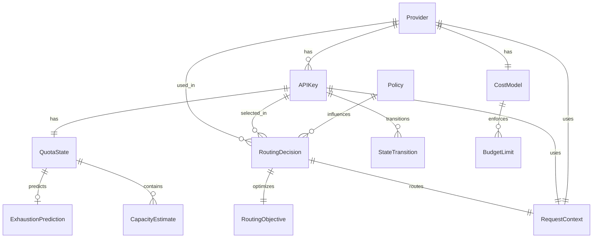

# Data Models

The following data models are derived from the first-principles requirements in the brainstorming session. Each model represents a core concept that must be explicit and observable.

## APIKey

**Purpose:** Represents an individual API key with explicit state, identity, and capacity tracking. Keys are not anonymous strings but first-class entities with stable identity.

**Key Attributes:**
- `id: str` - Stable, unique identifier (not the key material itself)
- `key_material: str` - Encrypted/secure storage of actual API key
- `provider_id: str` - Reference to Provider this key belongs to
- `state: KeyState` - Current state (Available, Throttled, Exhausted, Disabled, Invalid)
- `state_updated_at: datetime` - When state last changed
- `metadata: dict` - Provider-specific metadata (account info, tier, etc.)
- `created_at: datetime` - When key was registered
- `last_used_at: datetime | None` - Last successful usage
- `usage_count: int` - Total requests made with this key
- `failure_count: int` - Total failures encountered
- `cooldown_until: datetime | None` - When key can be used again (if throttled)

**Relationships:**
- Belongs to one Provider
- Has one QuotaState (per time window)
- Has many RoutingDecisions (audit trail)
- Has many StateTransitions (state change history)

**State Machine:**
```
Available → Throttled → Available (after cooldown)
Available → Exhausted → Recovering → Available (after reset)
Any → Disabled (manual)
Any → Invalid (automatic, on auth failure)
```

## QuotaState

**Purpose:** Tracks remaining capacity over time with multi-state model. Forward-looking quota awareness, not backward-looking counting.

**Key Attributes:**
- `id: str` - Unique identifier
- `key_id: str` - Reference to APIKey
- `capacity_state: CapacityState` - Current state (Abundant, Constrained, Critical, Exhausted, Recovering)
- `remaining_capacity: CapacityEstimate` - Remaining capacity (exact, estimated, or bounded)
- `total_capacity: int | None` - Total capacity if known
- `used_capacity: int` - Amount consumed
- `time_window: TimeWindow` - Quota reset schedule (daily, hourly, monthly)
- `reset_at: datetime` - When quota resets
- `exhaustion_prediction: ExhaustionPrediction | None` - Predicted exhaustion time
- `uncertainty: UncertaintyLevel` - Confidence in capacity estimates (High, Medium, Low, Unknown)
- `updated_at: datetime` - Last update timestamp

**Relationships:**
- Belongs to one APIKey
- Has many CapacityConsumptions (usage history)

**Capacity States:**
- **Abundant:** >80% remaining, safe to use
- **Constrained:** 50-80% remaining, use with caution
- **Critical:** 20-50% remaining, avoid unless necessary
- **Exhausted:** <20% or hard limit hit, do not use
- **Recovering:** Exhausted but reset approaching, monitor

## CapacityEstimate

**Purpose:** Represents remaining capacity with explicit uncertainty modeling.

**Key Attributes:**
- `value: int | None` - Exact value if known
- `min_value: int | None` - Lower bound if estimated
- `max_value: int | None` - Upper bound if estimated
- `confidence: float` - Confidence level (0.0 to 1.0)
- `estimation_method: str` - How estimate was calculated
- `last_verified: datetime | None` - When estimate was last verified

## Provider

**Purpose:** Abstract provider concept. Providers adapt to system model, not vice versa.

**Key Attributes:**
- `id: str` - Unique identifier
- `name: str` - Provider name (e.g., "openai", "anthropic")
- `adapter_type: str` - Adapter implementation class
- `base_url: str` - API base URL
- `capabilities: ProviderCapabilities` - What this provider supports
- `health_state: HealthState` - Current health (Healthy, Degraded, Down)
- `last_health_check: datetime | None` - Last health check time
- `metadata: dict` - Provider-specific configuration

**Relationships:**
- Has many APIKeys
- Has many RoutingDecisions
- Has one CostModel (pricing information)

## ProviderCapabilities

**Purpose:** Explicit capability declaration (not assumed parity).

**Key Attributes:**
- `supports_streaming: bool` - Streaming support
- `supports_tools: bool` - Function/tool calling
- `supports_images: bool` - Image input/output
- `max_tokens: int | None` - Maximum tokens per request
- `rate_limit_per_minute: int | None` - Rate limit if known
- `custom_capabilities: dict` - Provider-specific features

## RoutingDecision

**Purpose:** Explainable routing choice with full context. Every routing decision is intentional and traceable.

**Key Attributes:**
- `id: str` - Unique identifier
- `request_id: str` - Reference to request
- `selected_key_id: str` - Which key was chosen
- `selected_provider_id: str` - Which provider was chosen
- `decision_timestamp: datetime` - When decision was made
- `objective: RoutingObjective` - What was optimized (cost, reliability, fairness, quality)
- `eligible_keys: list[str]` - Keys that were eligible
- `evaluation_results: dict` - How each key scored
- `explanation: str` - Human-readable explanation of choice
- `confidence: float` - Confidence in decision (0.0 to 1.0)
- `alternatives_considered: list[AlternativeRoute]` - Other options evaluated

**Relationships:**
- References one APIKey (selected)
- References one Provider (selected)
- References one RequestContext

## RoutingObjective

**Purpose:** Explicit objective for routing optimization.

**Key Attributes:**
- `primary: str` - Primary objective (cost, reliability, fairness, quality, latency)
- `secondary: list[str]` - Secondary objectives
- `constraints: dict` - Hard constraints (min reliability, max cost, etc.)
- `weights: dict` - Objective weights for multi-objective optimization

## CostModel

**Purpose:** Cost tracking and budget enforcement. Proactive cost control.

**Key Attributes:**
- `id: str` - Unique identifier
- `provider_id: str` - Reference to Provider
- `pricing_structure: PricingStructure` - How provider charges
- `estimated_cost_per_request: CostEstimate` - Expected cost calculation
- `actual_costs: list[ActualCost]` - Historical actual costs
- `budget_limits: list[BudgetLimit]` - Budget constraints
- `updated_at: datetime` - Last update

**Relationships:**
- Belongs to one Provider
- Has many BudgetLimits

## BudgetLimit

**Purpose:** Enforceable budget constraints at multiple scopes.

**Key Attributes:**
- `id: str` - Unique identifier
- `scope: BudgetScope` - Scope (global, per-key, per-provider, per-route)
- `scope_id: str | None` - Specific entity if scoped
- `limit_amount: Decimal` - Budget limit
- `period: TimeWindow` - Budget period (daily, monthly, etc.)
- `current_spend: Decimal` - Current spending
- `enforcement_mode: EnforcementMode` - Hard (reject) or Soft (warn)
- `reset_at: datetime` - When budget resets

## Policy

**Purpose:** Declarative policies that drive routing, cost control, and key selection.

**Key Attributes:**
- `id: str` - Unique identifier
- `name: str` - Policy name
- `type: PolicyType` - Type (routing, cost, key_selection, failure_handling)
- `scope: PolicyScope` - Where policy applies
- `rules: list[PolicyRule]` - Policy rules
- `priority: int` - Priority when multiple policies apply
- `enabled: bool` - Whether policy is active
- `created_at: datetime` - When policy was created
- `updated_at: datetime` - Last update

**Relationships:**
- Applied to many RoutingDecisions
- Can override or combine with other Policies

## RequestContext

**Purpose:** Full context for each API request - enables observability and correlation.

**Key Attributes:**
- `id: str` - Unique request identifier
- `correlation_id: str` - Correlation ID for tracing
- `request_timestamp: datetime` - When request was made
- `provider_id: str | None` - Provider used
- `key_id: str | None` - Key used
- `request_type: str` - Type of request (chat, completion, etc.)
- `estimated_cost: CostEstimate | None` - Cost estimate before execution
- `actual_cost: Decimal | None` - Actual cost after execution
- `response_status: int | None` - HTTP status code
- `response_time_ms: int | None` - Response time
- `success: bool` - Whether request succeeded
- `error: str | None` - Error message if failed
- `routing_decision_id: str | None` - Reference to RoutingDecision

**Relationships:**
- Has one RoutingDecision
- References one APIKey (if routed)
- References one Provider (if routed)

## StateTransition

**Purpose:** Audit trail for all state changes. Enables traceability and debugging.

**Key Attributes:**
- `id: str` - Unique identifier
- `entity_type: str` - Type of entity (APIKey, QuotaState, Provider)
- `entity_id: str` - Entity identifier
- `from_state: str` - Previous state
- `to_state: str` - New state
- `transition_timestamp: datetime` - When transition occurred
- `trigger: str` - What caused transition (request, error, policy, manual)
- `context: dict` - Additional context about transition
- `user_id: str | None` - User who triggered (if manual)

**Relationships:**
- References one entity (APIKey, QuotaState, or Provider)

## ExhaustionPrediction

**Purpose:** Predictive exhaustion calculation - forward-looking quota awareness.

**Key Attributes:**
- `key_id: str` - Reference to APIKey
- `predicted_exhaustion_at: datetime` - When exhaustion predicted
- `confidence: float` - Confidence in prediction (0.0 to 1.0)
- `calculation_method: str` - How prediction was calculated
- `current_usage_rate: float` - Requests per hour
- `remaining_capacity: int` - Remaining capacity
- `calculated_at: datetime` - When prediction was made

**Relationships:**
- References one APIKey
- References one QuotaState

---

## Data Model Relationships Diagram



---

## Design Decisions

1. **Keys have stable identity separate from material** - Enables rotation without breaking system
2. **QuotaState is separate from APIKey** - Allows multiple quota windows per key (daily, monthly, etc.)
3. **RoutingDecision is first-class** - Enables explainability and auditability
4. **Uncertainty is explicit** - CapacityEstimate models what we know vs. don't know
5. **StateTransitions are tracked** - Full audit trail for debugging and compliance
6. **CostModel is provider-scoped** - Different providers have different pricing
7. **Policies are declarative** - Express intent, not procedure

---

**Select 1-9 or just type your question/feedback:**

1. Proceed to next section (Components)
2. Challenge assumptions
3. Explore alternatives
4. Deep dive analysis
5. Risk assessment
6. Stakeholder perspective
7. Scenario planning
8. Constraint analysis
9. Expert consultation

Or type your feedback/questions about the Data Models section.
