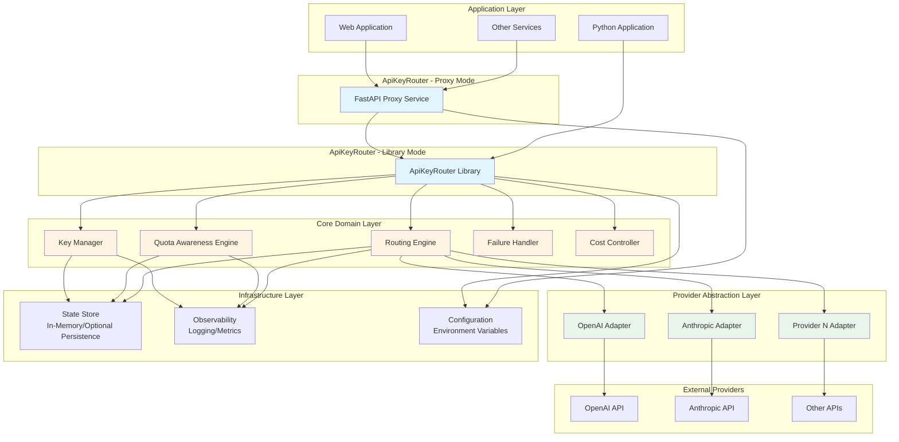

# High Level Architecture

## Technical Summary

ApiKeyRouter is designed as a **layered, event-driven architecture** with clear separation between core domain logic, application orchestration, and infrastructure concerns. The system implements **intelligent routing** through a policy-driven engine that makes state-dependent decisions based on predictive quota awareness, cost control, and provider health. The architecture supports **dual deployment modes**: an embeddable Python library for direct integration and an optional FastAPI-based proxy service for standalone operation. Core components include explicit state management (keys, quotas, routing decisions), provider abstraction through adapters, and graceful failure handling that reduces load under stress. The system is designed to be **stateless at the infrastructure level** (environment-based configuration) while maintaining rich in-memory state for routing intelligence, with optional persistence for production deployments.

## High Level Overview

**Architectural Style:** Layered Architecture with Domain-Driven Design principles

**Repository Structure:** Monorepo (single repository containing both library and proxy packages)

**Service Architecture:** 
- **Library Package:** Embeddable Python library with async/await support
- **Proxy Package:** Optional FastAPI-based HTTP proxy service
- **Shared Core:** Common domain models and abstractions

**Primary User Interaction Flow:**
1. **Library Mode:** Application imports library → Configures keys/providers → Makes API calls through library → Library routes intelligently based on state
2. **Proxy Mode:** Application sends HTTP requests to proxy → Proxy routes through library core → Returns normalized responses

**Key Architectural Decisions:**

1. **Explicit State Management:** All system state (keys, quotas, routing decisions) is first-class and observable, enabling explainable decisions and full observability
2. **Provider Abstraction:** Core system defines its own model; providers adapt through adapter pattern, enabling general-purpose capability beyond LLMs
3. **Predictive Quota Awareness:** Forward-looking capacity reasoning with multi-state model (Abundant → Constrained → Critical → Exhausted), not reactive counting
4. **Policy-Driven Routing:** Routing decisions driven by explicit objectives (cost, reliability, fairness) rather than simple round-robin
5. **Graceful Degradation:** System reduces load under failure, contains failures, and maintains partial service rather than all-or-nothing behavior
6. **Dual Architecture:** Library can operate standalone; proxy is optional wrapper that uses library internally
7. **Performance Benchmarking:** System must be benchmarked against competitors and performance targets to validate lightweight claim and ensure intelligent routing overhead is acceptable

## High Level Project Diagram

## Architectural and Design Patterns

**1. Layered Architecture Pattern**
- **Description:** Clear separation into Domain, Application, Infrastructure, and Interface layers
- **Rationale:** Enables testability, maintainability, and clear separation of concerns. Core domain logic is independent of infrastructure choices.

**2. Adapter Pattern (Provider Abstraction)**
- **Description:** Provider-specific logic contained in adapters; core system works with abstract provider interface
- **Rationale:** Enables general-purpose capability, easy extensibility, and prevents provider coupling from leaking into core logic.

**3. State Machine Pattern (Key & Quota States)**
- **Description:** Keys and quotas have explicit states with defined transitions (Available → Throttled → Exhausted → Recovering)
- **Rationale:** Enables predictive routing, explainable decisions, and graceful degradation. State is first-class and observable.

**4. Strategy Pattern (Routing Strategies)**
- **Description:** Different routing strategies (cost-optimized, reliability-optimized, fairness-based) as interchangeable algorithms
- **Rationale:** Enables policy-driven routing with explicit objectives. Users can choose or define custom routing strategies.

**5. Observer Pattern (Observability & Feedback)**
- **Description:** State changes emit events; observability systems, routing engine, and cost controller subscribe to events
- **Rationale:** Enables signal-driven adaptation, full observability, and feedback loops for learning and improvement.

**6. Repository Pattern (State Persistence)**
- **Description:** Abstract state storage interface with in-memory implementation and optional persistent implementations
- **Rationale:** Enables stateless deployment (in-memory) while supporting production persistence needs. Testable and flexible.

**7. Circuit Breaker Pattern (Failure Handling)**
- **Description:** Circuit breakers prevent routing to failing providers/keys, with automatic recovery monitoring
- **Rationale:** Implements graceful degradation - system reduces load under failure rather than amplifying through retries.

**8. Policy Pattern (Configuration)**
- **Description:** Routing, cost control, and key selection driven by declarative policies rather than procedural configuration
- **Rationale:** Enables safe defaults, explainable behavior, and progressive complexity. Users express intent, not implementation.

**9. Dependency Inversion Principle**
- **Description:** Core domain depends on abstractions; infrastructure implements those abstractions
- **Rationale:** Enables testability, flexibility, and prevents infrastructure concerns from polluting domain logic.

**10. Event-Driven Internal Communication**
- **Description:** Components communicate through events for state changes, enabling loose coupling and extensibility
- **Rationale:** Supports signal-driven adaptation, observability, and allows components to react to changes without tight coupling.

**11. Performance-First Design with Benchmarking**
- **Description:** Architecture designed with performance monitoring and benchmarking as first-class concerns. All components instrumented for performance metrics, with continuous benchmarking against competitors and performance targets.
- **Rationale:** Validates "lightweight library" claim, ensures intelligent routing overhead is acceptable, and provides data-driven optimization opportunities. Benchmarking ensures we maintain competitive performance while adding intelligence.
