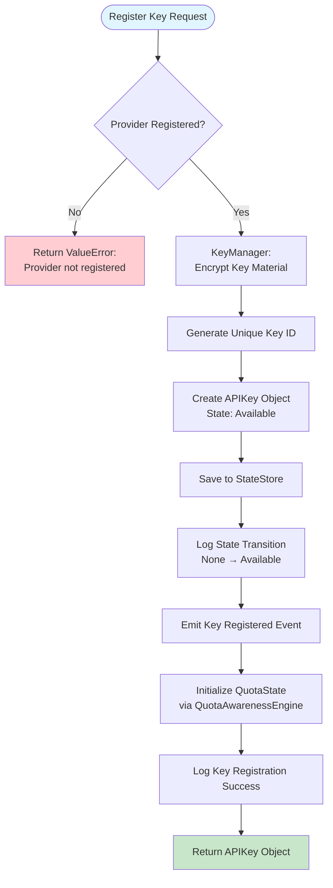
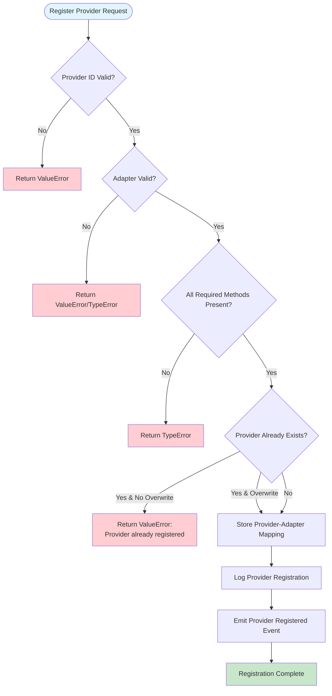
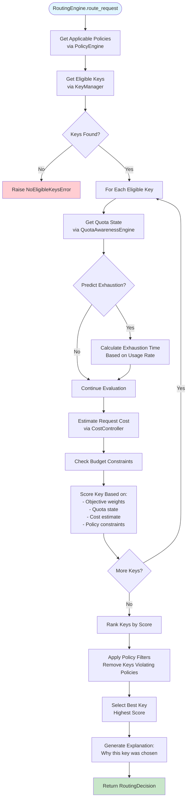
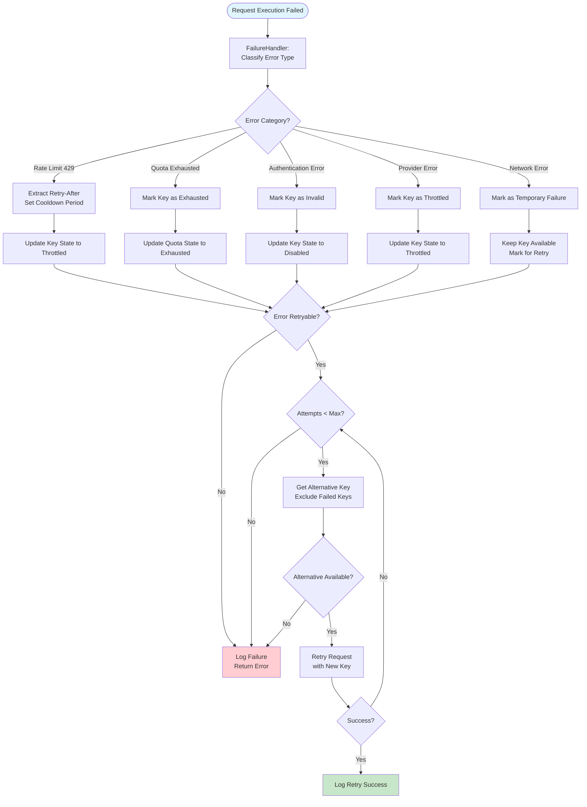
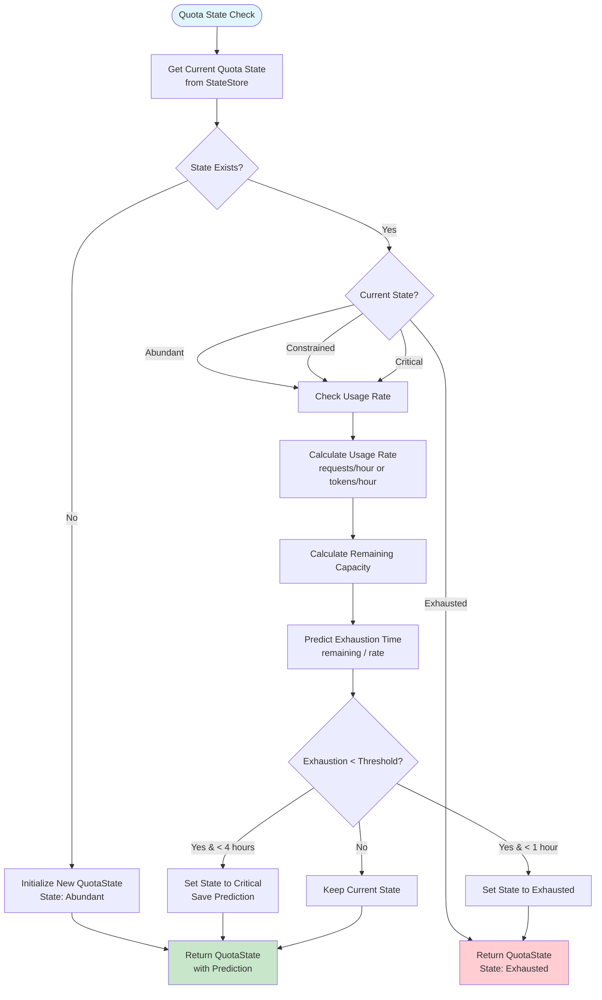
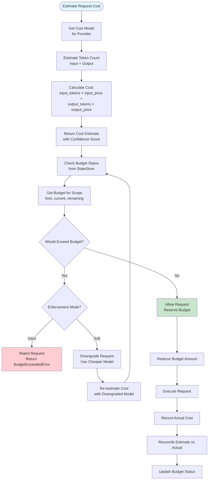
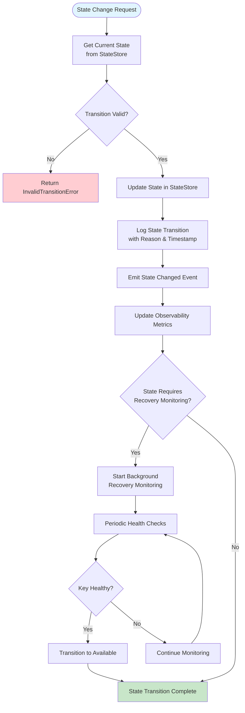
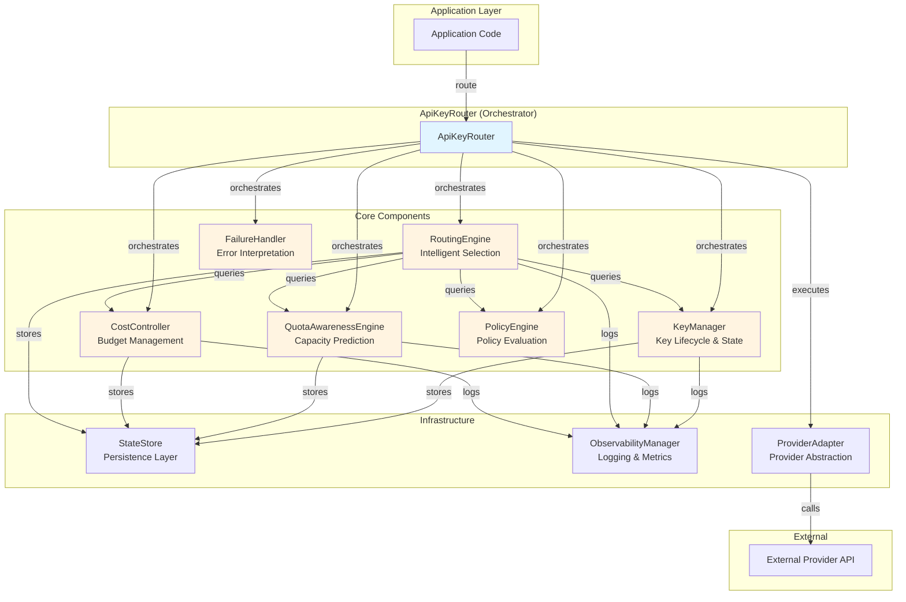

# ApiKeyRouter Product Flow

This document provides a comprehensive flowchart explaining how ApiKeyRouter processes requests from start to finish.

## Main Request Flow

```mermaid
flowchart TD
    Start([Application Makes Request]) --> Init{Request Intent Valid?}
    Init -->|No| Error1[Return ValueError]
    Init -->|Yes| LogStart[Log Request Start<br/>Generate request_id & correlation_id]
    
    LogStart --> GetObjective{Objective Provided?}
    GetObjective -->|No| DefaultObj[Use Default: Fairness]
    GetObjective -->|Yes| UseObj[Use Provided Objective]
    DefaultObj --> RouteEngine
    UseObj --> RouteEngine
    
    RouteEngine[RoutingEngine.route_request] --> GetEligible[Get Eligible Keys from KeyManager]
    GetEligible --> CheckQuota[For Each Key:<br/>Check Quota State via QuotaAwarenessEngine]
    CheckQuota --> EstimateCost[For Each Key:<br/>Estimate Cost via CostController]
    EstimateCost --> CheckBudget[For Each Key:<br/>Check Budget Constraints]
    CheckBudget --> Evaluate[Evaluate Keys Based on:<br/>- Objective cost/reliability/fairness<br/>- Quota state<br/>- Cost estimates<br/>- Policy constraints]
    
    Evaluate --> SelectKey{Keys Available?}
    SelectKey -->|No| NoKeys[Raise NoEligibleKeysError]
    SelectKey -->|Yes| BestKey[Select Best Key<br/>Generate Explanation]
    
    BestKey --> SaveDecision[Save Routing Decision to StateStore]
    SaveDecision --> LogDecision[Log Routing Decision]
    LogDecision --> GetAdapter[Get ProviderAdapter for Provider]
    
    GetAdapter --> Execute[Execute Request via Adapter]
    Execute --> CheckSuccess{Request Successful?}
    
    CheckSuccess -->|Yes| UpdateQuota[Update Quota State<br/>Record Token Usage]
    UpdateQuota --> UpdateStats[Update Key Usage Statistics]
    UpdateStats --> LogSuccess[Log Successful Completion]
    LogSuccess --> ReturnSuccess[Return SystemResponse]
    
    CheckSuccess -->|No| InterpretError[Interpret Error via FailureHandler]
    InterpretError --> UpdateKeyState[Update Key State<br/>Throttled/Exhausted/etc]
    UpdateKeyState --> CheckRetry{Retryable Error?}
    
    CheckRetry -->|No| LogFailure[Log Failure]
    LogFailure --> ReturnError[Return SystemError]
    
    CheckRetry -->|Yes| CheckAttempts{Attempts < Max?}
    CheckAttempts -->|No| LogFailure
    CheckAttempts -->|Yes| GetAltKey[Get Alternative Key<br/>Exclude Tried Keys]
    GetAltKey --> CheckAltKey{Alternative Key Available?}
    CheckAltKey -->|No| LogFailure
    CheckAltKey -->|Yes| Execute
    
    style Start fill:#e1f5ff
    style ReturnSuccess fill:#c8e6c9
    style ReturnError fill:#ffcdd2
    style NoKeys fill:#ffcdd2
    style Error1 fill:#ffcdd2
```

## Key Registration Flow

## Provider Registration Flow

## Routing Decision Flow (Detailed)

## Error Handling & Retry Flow

## Quota Awareness Flow

## Cost Estimation & Budget Flow

## State Transition Flow

## Component Interaction Overview

## Key Decision Points

1. **Routing Decision**: Based on objective (cost/reliability/fairness), quota state, cost estimates, and policies
2. **Error Handling**: Semantic error interpretation determines retry strategy
3. **Quota Prediction**: Forward-looking capacity analysis prevents routing to exhausted keys
4. **Budget Enforcement**: Cost estimation before execution with hard/soft enforcement modes
5. **State Transitions**: Explicit state management with validation and audit trails
6. **Retry Logic**: Intelligent retries with different keys, not blind retries

## Flow Characteristics

- **Async/Await**: All I/O operations are asynchronous
- **Graceful Degradation**: System continues operating with remaining keys when some fail
- **Observability**: All decisions and state changes are logged
- **Explainability**: Every routing decision includes an explanation
- **Predictive**: Quota exhaustion predicted before it happens
- **Policy-Driven**: Routing decisions respect configured policies

